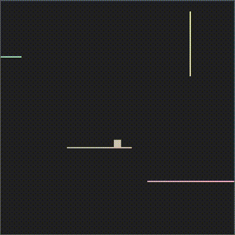

# kdo

<div align="center"></div>

Bare-bones [OpenGL](https://www.opengl.org/) platformer engine.

Needed things
---
* [Nix](https://nixos.org/download.html)

Quick start
---
```
$ nix-shell
[nix-shell:path/to/kdo]$ ./scripts/run.sh      # build, run
[nix-shell:path/to/kdo]$ ./scripts/profile.sh  # profile via `$ perf`
```

Controls
--
* `move` - <kbd>a</kbd> <kbd>d</kbd>
* `jump` - <kbd>w</kbd>
* `drop` - <kbd>s</kbd>
* `reload config` - <kbd>r</kbd>
* `quit` - <kbd>Esc</kbd>
